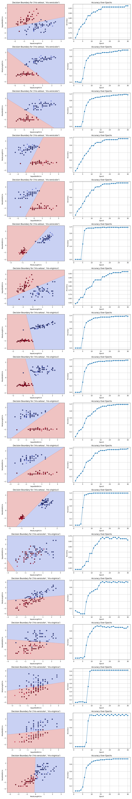

# Perceptron Algorithm Implementation and Evaluation

## Problem Statement

The objective of this assignment is to implement the Perceptron algorithm from scratch, evaluate its performance on various class and feature combinations of the IRIS dataset, and extend this evaluation to the Fish Market dataset as a bonus challenge.  
The primary goals include:

- Training a Perceptron for binary classification
- Visualizing decision boundaries
- Analyzing accuracy across different class and feature combinations

## Dataset Overview

### IRIS Dataset

The IRIS dataset contains measurements of sepal length, sepal width, petal length, and petal width for three species of Iris flowers: _Setosa_, _Versicolor_, and _Virginica_. In this assignment, binary classification is achieved by evaluating two classes at a time.

- **Classes Selected for Binary Classification:** All 3 possible pairs of classes
- **Features Selected:** All possible pairs of features (4C2 combinations)
- **Data Splitting:** 80% for training, 20% for testing

### Fish Market Dataset (Bonus Challenge)

The Fish Market dataset contains attributes such as species, weight, length, height, and width of fish specimens including Bream, Roach, Parkki, Perch, Pike, Smelt, and Whitefish.

- **Classes Selected:** As required for binary classification in this dataset
- **Features Selected:** Selected based on initial feature relevance analysis
- **Data Splitting:** 80% for training, 20% for testing

## Perceptron from Scratch

The Perceptron algorithm was implemented from scratch without the use of built-in machine learning libraries. Below is an outline of the algorithm steps:

1. **Initialization:** Weights and bias were initialized to zero.
2. **Forward Pass:** Predictions were made based on the sign of the weighted sum of inputs.
3. **Update Rule:** Weights were adjusted for misclassified samples using the formula: $w_i = w_i + \eta \cdot (y - \hat{y}) \cdot x_i$

This approach was applied to each of the binary classification pairs of the IRIS dataset features and classes.

## Evaluation of 4C2 Combinations on IRIS Dataset

For each combination of two classes and two features, the Perceptron model was trained, and both training and testing accuracy were evaluated.

### Combinations Evaluated

- **Classes:** All 3 pairs of classes
- **Features:** All 6 combinations of feature pairs (4C2)

### Accuracy Results

| Class Pair                        | Feature Pair                 | Training Accuracy | Testing Accuracy |
| --------------------------------- | ---------------------------- | ----------------- | ---------------- |
| Iris-setosa vs Iris-versicolor    | SepalLengthCm, SepalWidthCm  | 0.97              | 0.95             |
| Iris-setosa vs Iris-versicolor    | SepalLengthCm, PetalLengthCm | 1.00              | 0.95             |
| Iris-setosa vs Iris-versicolor    | SepalLengthCm, PetalWidthCm  | 1.00              | 1.00             |
| Iris-setosa vs Iris-versicolor    | SepalWidthCm, PetalLengthCm  | 0.97              | 1.00             |
| Iris-setosa vs Iris-versicolor    | SepalWidthCm, PetalWidthCm   | 0.97              | 1.00             |
| Iris-setosa vs Iris-versicolor    | PetalLengthCm, PetalWidthCm  | 0.99              | 1.00             |
| Iris-setosa vs Iris-virginica     | SepalLengthCm, SepalWidthCm  | 0.97              | 1.00             |
| Iris-setosa vs Iris-virginica     | SepalLengthCm, PetalLengthCm | 1.00              | 1.00             |
| Iris-setosa vs Iris-virginica     | SepalLengthCm, PetalWidthCm  | 1.00              | 1.00             |
| Iris-setosa vs Iris-virginica     | SepalWidthCm, PetalLengthCm  | 0.97              | 1.00             |
| Iris-setosa vs Iris-virginica     | SepalWidthCm, PetalWidthCm   | 0.99              | 1.00             |
| Iris-setosa vs Iris-virginica     | PetalLengthCm, PetalWidthCm  | 0.99              | 1.00             |
| Iris-versicolor vs Iris-virginica | SepalLengthCm, SepalWidthCm  | 0.53              | 0.40             |
| Iris-versicolor vs Iris-virginica | SepalLengthCm, PetalLengthCm | 0.96              | 0.85             |
| Iris-versicolor vs Iris-virginica | SepalLengthCm, PetalWidthCm  | 0.93              | 0.90             |
| Iris-versicolor vs Iris-virginica | SepalWidthCm, PetalLengthCm  | 0.96              | 0.80             |
| Iris-versicolor vs Iris-virginica | SepalWidthCm, PetalWidthCm   | 0.94              | 0.95             |
| Iris-versicolor vs Iris-virginica | PetalLengthCm, PetalWidthCm  | 0.95              | 0.85             |

## Overall Average Training vs Testing Accuracy Result for Iris Dataset

The overall average accuracy was calculated across all combinations:

- **Average Training Accuracy:** 0.95
- **Average Testing Accuracy:** 0.93

## Decision Boundary Plot and Accuracy Over Epoch Plot

- Decision boundary plots show the model's classification regions, illustrating how well the Perceptron separates the classes.
- Accuracy was tracked across epochs to observe the convergence of the Perceptron algorithm.

---

## Bonus Challenge (Fish Market Dataset)

The Fish Market dataset was similarly evaluated using the Perceptron model. Challenges encountered included...

---

## Conclusion

The single perceptron model is not suitable for the Fish Market dataset due to several limitations:

- **Complexity of the Fish Market Dataset:** The dataset likely contains multiple features and complex relationships.
- **Limitations of Single Layer Perceptron:**

1. **Linear Separability:** The dataset is likely not linearly separable.
2. **Binary Classification:** Single-layer perceptron are limited to binary classification tasks.
3. **Lack of Hidden Layers:** A single perceptron cannot learn complex feature interactions.
